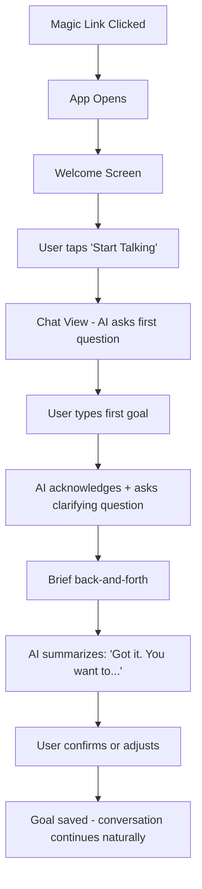
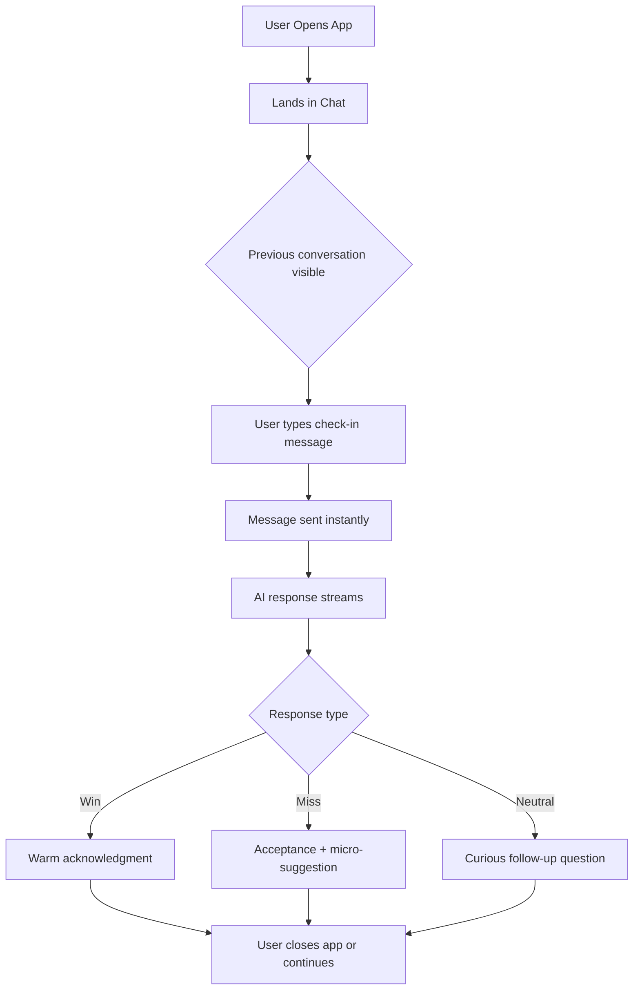
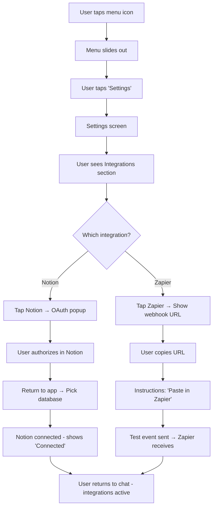
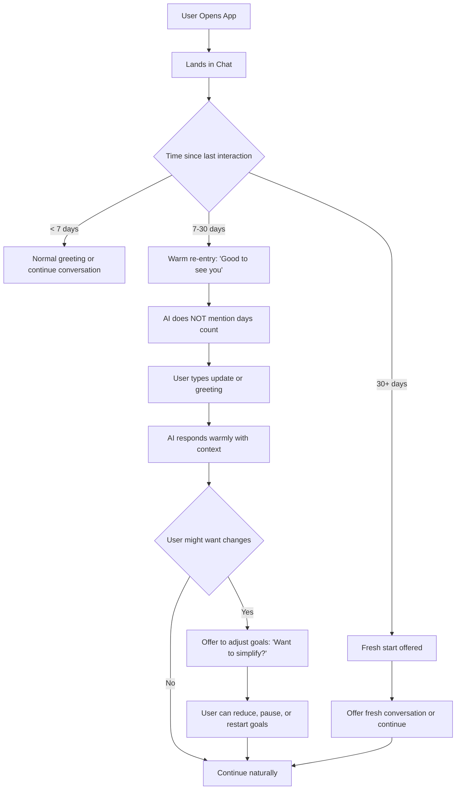

# UX Design Specification: Resolution Tracker

**Author:** Justin
**Date:** 2026-01-13

---

## Executive Summary

### Project Vision

Resolution Tracker is a conversational AI coach that helps users stick with their yearly goals by maintaining context, memory, and a warm relationship — solving the "February problem" where motivation fades and traditional apps fail.

The core UX philosophy: **conversation is the product**. Unlike checkbox-driven goal trackers that feel like chores, Resolution Tracker feels like texting a supportive friend who actually remembers your story. No guilt mechanics, no streaks, no passive-aggressive notifications — just a warm presence that meets users where they are.

### Target Users

**Primary: The Busy Builder (Alex)**
- Knowledge workers (developers, designers, makers) with demanding jobs
- 2-4 personal goals that matter deeply but slip through the cracks
- Mentally exhausted by end of day — needs low-friction, not more work
- Seeks accountability that feels supportive, not surveillance
- Tech-savvy but values simplicity over power-user features

**Usage Context:**
- Mobile-first (responsive web, not native)
- Quick check-ins throughout the day or evening wind-down
- Conversational interactions under 60 seconds
- Occasional desktop use for integrations setup

### Key Design Challenges

| Challenge | Implication |
|-----------|-------------|
| **Conversation as Interface** | Chat must feel like texting a friend, not talking to a bot. UI should disappear — conversation is the star. |
| **Progress Without Guilt** | No streaks, percentages, or red/green shame indicators. Show progress in a way that encourages, not judges. |
| **The Warm Return** | When users come back after days/weeks away, the experience must feel like a welcome, not disappointment. Critical to retention. |
| **Mobile-First Constraints** | Touch-friendly, thumb-zone aware, fast-loading. Every interaction optimized for one-handed phone use. |

### Design Opportunities

| Opportunity | Approach |
|-------------|----------|
| **Chat-First Architecture** | Conversation is the primary interface. Dashboard, goals, settings are all secondary. Rare and differentiated. |
| **Emotional Design Language** | Warm colors, soft shapes, friendly typography. Visual design that matches the AI's supportive tone. |
| **"Better Than Nothing" Philosophy** | When goals feel big, surface micro-actions. Make small feel celebrated, not insufficient. |
| **Anti-Gamification Stance** | No streaks, badges, or leaderboards. Progress shown through narrative and reflection, not metrics. |

## Core User Experience

### Defining Experience

The core experience is a **conversational check-in loop**:

1. User opens app → lands directly in chat (no intermediary screens)
2. User types a short message ("gym today" / "skipped, work chaos")
3. AI responds with streaming text — contextual, warm, remembers history
4. Conversation continues or user closes app

This is a **messaging app**, not a productivity app. The mental model is iMessage or WhatsApp, not Todoist or Notion. Users should feel like they're texting a friend who happens to have perfect memory.

**The Core Action:** Sending a quick check-in message and receiving a contextual response.

**Time to Value:** Under 10 seconds from app open to message sent.

### Platform Strategy

| Aspect | Decision |
|--------|----------|
| **Primary Platform** | Mobile web (responsive) |
| **Secondary Platform** | Desktop web (same app, responsive) |
| **Native Apps** | Out of scope for MVP |
| **Interaction Model** | Touch-first, thumb-zone optimized |
| **Offline Support** | Not required for MVP (always-connected assumed) |

**Mobile-First Implications:**
- Large touch targets for message input
- Keyboard appears immediately on chat focus
- Minimal chrome — conversation fills the screen
- Bottom-anchored input (thumb-friendly)
- Fast initial load (<2s on 3G)

### Effortless Interactions

| Interaction | Effortless Design |
|-------------|-------------------|
| **Opening the app** | Direct to chat. No splash, no dashboard, no friction. |
| **Sending a check-in** | Single text input, send on enter/tap. No forms, categories, or dropdowns. |
| **Reading AI response** | Streaming text appears immediately. No loading spinners, no waiting. |
| **Returning after absence** | No guilt UI. AI greets warmly. History preserved but not highlighted. |
| **Viewing goals** | Accessible but not prominent. Swipe or tap to see, conversation stays primary. |

### Critical Success Moments

| Moment | Why It Matters |
|--------|----------------|
| **First AI response with context** | "Wait, it remembers I mentioned Tuesdays are hard?" — This is the aha moment. |
| **The warm return** | After 17 silent days, the AI says "Good to see you" — not "You've been gone 17 days." |
| **The micro-suggestion** | "Couldn't make the gym? How about 20 pushups?" — Turns failure into action. |
| **The quick check-in** | User sends message, gets response, closes app in under 30 seconds. Felt supported, not burdened. |

### Experience Principles

1. **Conversation is the product.** Everything else (dashboard, goals, settings) is secondary. The chat is home.

2. **Disappearing UI.** The interface should feel invisible. No chrome competing with the conversation.

3. **Instant and streaming.** Responses appear immediately, character by character. No spinners, no "AI is thinking..." delays.

4. **Memory without surveillance.** The AI remembers everything but never weaponizes it. Context creates connection, not guilt.

5. **Small is celebrated.** 20 pushups is a win. One Spanish flashcard is progress. The UX never makes "better than nothing" feel insufficient.

## Desired Emotional Response

### Primary Emotional Goals

**Core Feeling: "Someone's got my back."**

Resolution Tracker should feel like a supportive friend who:
- Remembers your story without judging it
- Celebrates small wins without making you feel like you need big ones
- Welcomes you back without mentioning how long you've been gone
- Believes in you even when you don't

This is not a coach, not a parent, not a gamified system. It's a presence — warm, consistent, and on your side.

### Emotional Journey Map

| Stage | User State | Desired Emotion | Design Implication |
|-------|------------|-----------------|-------------------|
| **First open** | Curious, maybe skeptical | Ease, simplicity | No onboarding walls, straight to conversation |
| **Typing check-in** | Tired, maybe rushed | Lightness, low effort | Single input, no forms, send instantly |
| **Reading AI response** | Waiting, hopeful | Surprise, warmth | Streaming text, contextual memory, personal tone |
| **After a win** | Accomplished | Quiet pride | Warm acknowledgment, not fireworks |
| **After a miss** | Guilty, deflated | Acceptance, redirect | "Better than nothing" micro-suggestion |
| **Returning after absence** | Shame, hesitation | Relief, welcome | No guilt UI, warm re-entry, fresh start option |
| **Completing a goal** | Proud, reflective | Quiet celebration | Simple, genuine — "You did it. Proud of you." |

### Micro-Emotions

**Emotions to cultivate:**

| Emotion | Why It Matters |
|---------|----------------|
| **Trust** | User believes the AI genuinely cares, isn't manipulating them |
| **Confidence** | User always knows what to do next, no confusion |
| **Accomplishment** | Small actions feel meaningful, not insufficient |
| **Belonging** | Someone's in their corner, they're not alone |
| **Safety** | Can be honest about failures without judgment |

**Emotions to prevent:**

| Emotion | How We Prevent It |
|---------|-------------------|
| **Guilt** | No streaks, no "missed days" counters, no passive-aggressive copy |
| **Anxiety** | No red indicators, no urgency, no push notifications in MVP |
| **Overwhelm** | Minimal UI, one action at a time, goals stay backgrounded |
| **Surveillance creep** | Memory feels supportive ("I remember you said...") not creepy ("You said X on January 3rd") |

### Emotional Design Principles

1. **Warmth over efficiency.** The AI can take an extra sentence to be kind. Speed isn't the only metric.

2. **Acknowledgment over celebration.** A goal completed gets "You did it. Proud of you." — not confetti and fireworks.

3. **Acceptance over accountability.** When users fail, meet them where they are. Don't remind them of the gap.

4. **Presence over persuasion.** The app is always there, never pushy. No notifications begging for attention.

5. **Memory as connection.** Remembering details creates intimacy ("You mentioned Tuesdays are hard") — never weaponize it ("You've missed 3 Tuesdays").

## UX Pattern Analysis & Inspiration

### Inspiring Products Analysis

| Product | What They Nail | What We Take |
|---------|----------------|--------------|
| **iMessage** | Zero-friction messaging. Open → type → send. Conversation fills screen, UI disappears. Input anchored at bottom for thumb reach. | The interaction model: chat-first, instant, effortless. No learning curve. |
| **Headspace** | Warm, calm, non-judgmental tone. Soft colors, rounded shapes, gentle animations. Copy feels like a friend, not a coach. | The emotional design language: warmth, softness, quiet encouragement. |
| **Factory.ai** | Clean minimalism with confident typography. Generous whitespace, grid-based precision. Professional without being cold. | The visual structure: whitespace, hierarchy, modern sans-serif type, layout confidence. |

### Design Synthesis: "Confident Warmth"

The visual direction combines:
- **Structure from Factory.ai** — Grid precision, generous whitespace, confident typography
- **Warmth from Headspace** — Soft colors, rounded corners, gentle micro-interactions
- **Interaction from iMessage** — Chat-first, bottom-anchored input, streaming responses

**The result:** A meditation app designed by a premium tech studio. Minimal but not cold. Confident but not intimidating. Warm but not childish.

### Transferable UX Patterns

**Navigation Patterns:**
| Pattern | Source | Application |
|---------|--------|-------------|
| Chat as home screen | iMessage | User lands directly in conversation, no intermediary |
| Minimal chrome | Factory.ai | Header/nav nearly invisible, content is king |
| Bottom-anchored input | iMessage | Thumb-friendly, always accessible on mobile |

**Interaction Patterns:**
| Pattern | Source | Application |
|---------|--------|-------------|
| Streaming text | iMessage/ChatGPT | AI response appears character-by-character |
| Tap to send | iMessage | Single action, no confirmation dialogs |
| Pull to refresh (optional) | iOS conventions | Natural gesture for checking updates |

**Visual Patterns:**
| Pattern | Source | Application |
|---------|--------|-------------|
| Generous whitespace | Factory.ai | Let the conversation breathe |
| Soft rounded corners | Headspace | Friendly, approachable containers |
| Warm neutral palette | Headspace | Light backgrounds, warm grays, gentle accents |

### Anti-Patterns to Avoid

| Anti-Pattern | Why It Fails | Our Alternative |
|--------------|--------------|-----------------|
| **Streak counters** | Creates guilt, triggers shame spirals | No visible counters or "days since" |
| **Red/green indicators** | Judgmental, anxiety-inducing | Neutral colors, no pass/fail visual language |
| **Onboarding carousels** | Delays value, users skip anyway | Straight to conversation, learn by doing |
| **Notification badges** | Nagging, creates obligation | No badges, no guilt mechanics |
| **Complex dashboards** | Overwhelming, splits attention | Minimal dashboard, conversation is primary |
| **Gamification elements** | Manipulative, short-term motivation | Intrinsic motivation through relationship |

### Design Inspiration Strategy

**Adopt directly:**
- Chat-first architecture (iMessage)
- Bottom-anchored text input (iMessage)
- Streaming AI responses (modern convention)
- Generous whitespace and grid structure (Factory.ai)

**Adapt for our context:**
- Headspace's warm palette → lighter, more neutral (less blue/purple, more warm white/cream)
- Factory.ai's dark confidence → translate to light mode with warm accents
- Rounded corners everywhere → but not overly bubbly, keep it refined

**Explicitly avoid:**
- Any gamification (streaks, badges, leaderboards)
- Red/green success/failure indicators
- Notification-heavy patterns
- Complex multi-screen flows
- Cold, sterile "productivity app" aesthetics

## Design System Foundation

### Design System Choice

**Primary:** Tailwind CSS + shadcn/ui

A component library built specifically for the Next.js + Tailwind stack. Components are copy-pasted into the codebase (not npm dependencies), giving full control over customization while maintaining accessibility standards via Radix UI primitives.

### Rationale for Selection

| Factor | Decision Driver |
|--------|-----------------|
| **Stack alignment** | Built for Next.js + Tailwind — zero friction with existing architecture |
| **Customization control** | Components live in codebase, can modify every detail for "confident warmth" |
| **Accessibility** | Radix UI primitives handle keyboard nav, screen readers, focus management |
| **Mobile-first ready** | Responsive defaults, touch-friendly sizing out of the box |
| **Developer experience** | Solo developer can move fast without sacrificing quality |
| **No vendor lock-in** | Own the code, no breaking changes from upstream updates |

### Implementation Approach

**Phase 1: Foundation Setup**
- Install shadcn/ui CLI and initialize with project
- Configure Tailwind with custom warm color palette
- Set up CSS variables for consistent theming

**Phase 2: Component Customization**
- Warm up default components (colors, radii, shadows)
- Create chat-specific components (message bubbles, input bar)
- Build minimal navigation components

**Phase 3: Design Tokens**
- Establish spacing scale (generous, breathing room)
- Define typography scale (mobile-first, readable)
- Lock in color palette as reusable tokens

### Customization Strategy

**Color Palette — "Confident Warmth"**

| Token | Value | Usage |
|-------|-------|-------|
| `--background` | Warm off-white (#FEFDFB or similar) | Page backgrounds |
| `--foreground` | Warm charcoal (#2D2A26) | Primary text |
| `--muted` | Warm gray (#F5F3F0) | Secondary backgrounds, borders |
| `--accent` | Soft amber (#F5A623 / amber-400 range) | Interactive elements, highlights |
| `--accent-soft` | Pale amber (#FEF3E2) | Hover states, subtle highlights |

**Border Radius — Friendly, Not Childish**

| Element | Radius |
|---------|--------|
| Buttons | `rounded-xl` (12px) |
| Cards/Containers | `rounded-2xl` (16px) |
| Message bubbles | `rounded-2xl` with tail |
| Input fields | `rounded-xl` (12px) |

**Shadows — Soft and Warm**
- Avoid hard drop shadows
- Use subtle, warm-tinted shadows (`shadow-sm` with warm gray tint)
- Prefer elevation through background color shifts over heavy shadows

**Typography**

| Role | Spec |
|------|------|
| Font family | Inter (default) or Plus Jakarta Sans (warmer alternative) |
| Body size | 16px base (mobile-readable) |
| Line height | 1.5-1.6 (generous, breathable) |
| Headings | Semi-bold, not heavy |

### Component Inventory (MVP)

| Component | shadcn Base | Customization Needed |
|-----------|-------------|---------------------|
| Button | `button` | Warm colors, softer radius |
| Input | `input` | Larger touch target, warm focus ring |
| Card | `card` | Warm background, softer shadow |
| Avatar | `avatar` | For AI persona representation |
| Skeleton | `skeleton` | Warm loading states |
| **Custom: ChatBubble** | None | Build from scratch — user vs AI styling |
| **Custom: ChatInput** | Based on `input` | Bottom-anchored, send button integrated |
| **Custom: GoalCard** | Based on `card` | Minimal, warm, no progress indicators |

## Defining Experience

### The One-Line Pitch

> "Tell your AI what happened, and feel understood."

The magic isn't the chat interface — that's just the vehicle. The magic is the *response*. The moment the AI says something that proves it knows you. That's the aha moment that creates loyalty.

### User Mental Model

**What users bring to this experience:**

| Expectation | Source | Implication |
|-------------|--------|-------------|
| "I just type and send" | iMessage, WhatsApp | Zero learning curve, no forms |
| "It should remember what I told it" | Human conversation | Context must persist across sessions |
| "It won't judge me" | Therapy/coaching model | Tone must be warm, never accusatory |
| "Quick interactions, not journaling" | Text messaging habits | Optimize for 1-2 sentences, not paragraphs |

**What users are escaping:**

| Current Solution | Why It Fails | Our Advantage |
|------------------|--------------|---------------|
| Habit tracker apps | Checkbox fatigue, guilt mechanics | Conversational, no pass/fail |
| Note-taking apps | No feedback, feels like shouting into void | AI responds with understanding |
| Accountability buddies | Requires coordination, social pressure | Always available, no judgment |
| Journaling apps | Time-consuming, no engagement | Quick check-ins, active response |

### Success Criteria

**The interaction succeeds when:**

| Criteria | Measurement |
|----------|-------------|
| **Speed** | Message sent within 10 seconds of opening |
| **Naturalness** | User types in plain language, no special syntax |
| **Recognition** | AI response references something specific from user's history |
| **Emotional landing** | User closes app feeling lighter, not burdened |
| **Return intent** | User wants to come back tomorrow |

**The "tell a friend" moment:**

> *"I told it I skipped the gym again, and it said 'Tuesdays have been hard for you lately — what's going on at work?' It actually remembered."*

This story — AI demonstrating genuine memory and care — is what users will share.

### Pattern Analysis

| Aspect | Classification | Notes |
|--------|---------------|-------|
| **Chat interface** | Established | Users know how to text — zero learning curve |
| **Streaming responses** | Established | ChatGPT normalized this; feels instant and alive |
| **Emotional AI memory** | Novel | Most AI is stateless; persistent emotional context is rare |
| **No-guilt design** | Novel | Anti-pattern to industry norms; requires intentional design |

**Our innovation lives in the AI's emotional intelligence, not the interface.**

The UI should be invisible — all innovation budget goes into how the AI *responds*, not how the user *inputs*.

### Experience Mechanics

**1. Initiation**

| Element | Design |
|---------|--------|
| Trigger | Open app |
| Landing | Directly in chat view |
| Invitation | Empty input field, cursor ready, perhaps a soft prompt ("How's it going?") |
| Friction | Zero — no splash, no dashboard, no choices |

**2. Interaction**

| Element | Design |
|---------|--------|
| Input method | Single text field, bottom-anchored |
| Send action | Tap send button or press Enter |
| Message length | Optimized for 1-2 sentences (but accepts more) |
| Typing feel | Large touch target, instant keyboard appearance |

**3. Feedback**

| Element | Design |
|---------|--------|
| Response timing | Immediate streaming (no "thinking" delay) |
| Visual treatment | AI messages in distinct but warm style |
| Content quality | References context, acknowledges emotion, offers micro-action if appropriate |
| Length | Concise — matches user's energy (short input → short response) |

**4. Completion**

| Element | Design |
|---------|--------|
| Done signal | Natural conversation pause — user simply stops |
| Exit action | Close app or navigate away (no "save" needed) |
| Emotional state | Lighter, supported, not burdened with tasks |
| Next session | AI remembers everything; continuity is automatic |

## Visual Design Foundation

### Color System

**Core Palette — "Confident Warmth"**

| Token | Hex | RGB | Usage |
|-------|-----|-----|-------|
| `--background` | #FEFDFB | 254, 253, 251 | Page background, main canvas |
| `--background-secondary` | #FAF8F5 | 250, 248, 245 | Cards, elevated surfaces |
| `--foreground` | #2D2A26 | 45, 42, 38 | Primary text |
| `--foreground-muted` | #6B6560 | 107, 101, 96 | Secondary text, placeholders |
| `--border` | #E8E4DF | 232, 228, 223 | Dividers, input borders |
| `--accent` | #E59500 | 229, 149, 0 | Primary actions, highlights (amber-500) |
| `--accent-soft` | #FEF3E2 | 254, 243, 226 | Hover states, subtle highlights |
| `--accent-foreground` | #FFFFFF | 255, 255, 255 | Text on accent backgrounds |

**Semantic Colors — No Judgment**

Our "no guilt" principle means avoiding traditional red/green success/failure indicators. Instead:

| Purpose | Traditional | Our Approach | Hex |
|---------|-------------|--------------|-----|
| **Success/Positive** | Green | Soft amber (celebratory) | #E59500 |
| **Neutral info** | Blue | Warm gray | #6B6560 |
| **Gentle warning** | Yellow/Orange | Muted amber | #D4A574 |
| **Error (system only)** | Red | Soft coral (not aggressive) | #D4756A |

*Note: Error states are for system errors only (failed to send, network issues) — never for user "failures" like missed goals.*

**Message Bubble Colors**

| Element | Background | Text |
|---------|------------|------|
| User message | `--accent` (#E59500) | White |
| AI message | `--background-secondary` (#FAF8F5) | `--foreground` |

### Typography System

**Font Stack**

| Role | Font | Fallback |
|------|------|----------|
| Primary | Inter | -apple-system, system-ui, sans-serif |
| Alternative | Plus Jakarta Sans | Inter, sans-serif |

*Inter is clean and highly legible. Plus Jakarta Sans adds slightly more warmth — evaluate during implementation.*

**Type Scale (Mobile-First)**

| Token | Size | Weight | Line Height | Usage |
|-------|------|--------|-------------|-------|
| `--text-xs` | 12px | 400 | 1.5 | Timestamps, metadata |
| `--text-sm` | 14px | 400 | 1.5 | Secondary text, captions |
| `--text-base` | 16px | 400 | 1.6 | Body text, messages |
| `--text-lg` | 18px | 500 | 1.5 | Emphasis, subheadings |
| `--text-xl` | 20px | 600 | 1.4 | Section headings |
| `--text-2xl` | 24px | 600 | 1.3 | Page titles |

**Typography Principles**

1. **Generous line height** — 1.5-1.6 for body text; reading should feel effortless
2. **Semi-bold, not bold** — Headings use 600 weight max; nothing shouty
3. **Size for thumb distance** — Mobile text never below 14px for interactive elements
4. **Warmth through spacing** — Letter-spacing slightly loose for friendly feel

### Spacing & Layout Foundation

**Base Unit: 4px**

All spacing derives from a 4px base, but primary increments use 8px multiples for visual rhythm.

| Token | Value | Usage |
|-------|-------|-------|
| `--space-1` | 4px | Tight gaps, icon padding |
| `--space-2` | 8px | Inline spacing, small gaps |
| `--space-3` | 12px | Related element spacing |
| `--space-4` | 16px | Component internal padding |
| `--space-5` | 20px | Between components |
| `--space-6` | 24px | Section spacing |
| `--space-8` | 32px | Major section breaks |
| `--space-10` | 40px | Page-level margins |

**Layout Principles**

| Principle | Implementation |
|-----------|----------------|
| **Generous breathing room** | Minimum 16px padding on all containers |
| **Mobile-first margins** | 16px horizontal page margins on mobile, 24px+ on desktop |
| **Conversation density** | 8px between message bubbles (tight enough to feel connected) |
| **Touch targets** | Minimum 44x44px for all interactive elements |

**Chat Layout Specifics**

| Element | Specification |
|---------|---------------|
| Message bubble max-width | 85% of container (prevents wall-of-text feel) |
| Input bar height | 56px minimum (comfortable thumb reach) |
| Input bar padding | 16px horizontal, safe-area-aware on mobile |
| Keyboard spacing | Input stays visible above keyboard |

### Accessibility Considerations

**Contrast Ratios (WCAG AA)**

| Combination | Ratio | Status |
|-------------|-------|--------|
| Foreground on Background | ~15:1 | Exceeds AA |
| Muted text on Background | ~4.8:1 | Passes AA |
| Accent on Background | ~3.2:1 | Use for large text/icons only |
| White on Accent | ~3.5:1 | Passes AA for large text |

**Touch & Interaction**

| Requirement | Implementation |
|-------------|----------------|
| Minimum touch target | 44x44px (iOS HIG standard) |
| Focus indicators | Soft amber ring (2px, visible on all backgrounds) |
| Tap feedback | Subtle scale + opacity change on press |
| Keyboard navigation | Full support via Radix UI primitives |

**Motion & Animation**

| Type | Approach |
|------|----------|
| Transitions | 150-200ms ease-out (snappy, not sluggish) |
| Loading states | Gentle pulse, warm skeleton colors |
| Streaming text | Character-by-character, no jarring reflows |
| Reduced motion | Respect `prefers-reduced-motion` media query |

## Design Direction

### Chosen Direction: "Confident Warmth"

A single cohesive visual direction synthesizing all decisions made throughout this process:
- **Structure:** Clean minimalism with confident typography (Factory.ai influence)
- **Warmth:** Soft amber accents, warm neutrals, rounded corners (Headspace influence)
- **Interaction:** Chat-first, bottom-anchored input, streaming responses (iMessage influence)

### Visual Identity Summary

| Element | Decision |
|---------|----------|
| Primary color | Soft amber (#E59500) |
| Background | Warm off-white (#FEFDFB) |
| Typography | Inter, semi-bold headings |
| Border radius | Generous (12-20px) |
| AI representation | Subtle icon (warm circle with simple face) |
| Message bubbles | User = amber, AI = warm gray |

### Screen Hierarchy

| Screen | Role | Access |
|--------|------|--------|
| **Chat** | Primary — user lands here | Default home |
| **Goals** | Secondary — view/edit goals | Menu or swipe |
| **Settings** | Tertiary — integrations, account | Menu only |

### Design Mockup

Interactive HTML mockup available at: `_bmad-output/planning-artifacts/ux-design-mockup.html`

Demonstrates all four key screens with actual colors, typography, and component styling applied.

## User Journey Flows

### Journey 1: Fresh Start (Onboarding)

**Goal:** New user goes from signup to first meaningful conversation in under 2 minutes.

**Entry point:** Magic link email → App opens



**Key UX decisions:**
- No traditional onboarding forms — everything is conversational
- AI asks one question at a time (not overwhelming)
- User can set 1-5 goals through natural conversation
- No forced "complete your profile" step

**Success moment:** AI's first contextual response ("So you want to hit the gym but mornings are tough?")

---

### Journey 2: The Mixed Day (Core Check-in Loop)

**Goal:** User logs a check-in and feels supported in under 30 seconds.

**Entry point:** User opens app (returning user)



**Key UX decisions:**
- Conversation history visible but not highlighted (no "you last checked in X days ago")
- AI matches user's energy (short input → concise response)
- Micro-suggestions offered gently, not prescriptively
- No confirmation needed to send — tap send, done

**Success moment:** AI references past context ("Tuesdays have been hard lately...")

---

### Journey 3: Sunday Tinkering (Integrations Setup)

**Goal:** User connects Notion and/or Zapier to sync their data.

**Entry point:** User navigates to Settings via menu



**Key UX decisions:**
- OAuth flow handles Notion auth (no manual API keys)
- Zapier is webhook-based (user copies URL, pastes in Zapier)
- Clear confirmation when connection succeeds
- User can always return to settings to disconnect

**Success moment:** Goals appear in Notion within seconds of connecting.

---

### Journey 4: The Quiet Return (Re-engagement)

**Goal:** User returns after absence and feels welcomed, not judged.

**Entry point:** User opens app after 17+ days away



**Key UX decisions:**
- NO guilt messaging ("You've been gone for 17 days!")
- NO streak-lost notifications
- AI greets warmly regardless of absence length
- Fresh start option available but not pushed
- Goals remain intact — user chooses whether to modify

**Success moment:** "Hey, good to see you. How are you doing?" — not mentioning the gap.

---

### Journey Patterns

**Common patterns across all journeys:**

| Pattern | Implementation |
|---------|----------------|
| **Chat as home** | Every journey starts or returns to chat view |
| **Conversational-first** | No forms, no wizards — everything through dialogue |
| **No guilt mechanics** | Time gaps never mentioned, no negative indicators |
| **Streaming feedback** | All AI responses appear character-by-character |
| **Minimal navigation** | Maximum 2 taps to any secondary screen |

---

### Flow Optimization Principles

1. **Time to value < 30 seconds** — User should feel supported within half a minute of any action
2. **One question at a time** — Never overwhelm with multiple asks
3. **Context over configuration** — AI infers preferences from conversation, doesn't ask for settings
4. **Graceful degradation** — If something fails (network, AI error), message clearly and offer retry
5. **Always recoverable** — No destructive actions without clear undo or confirmation

## Component Strategy

### Design System Components (shadcn/ui)

**Available and will use as-is:**

| Component | Usage | Customization |
|-----------|-------|---------------|
| `Button` | Send message, CTA buttons | Warm colors, rounded-xl |
| `Input` | Base for chat input | Larger touch target |
| `Card` | Settings items, goal cards | Softer shadows, warm borders |
| `Avatar` | AI icon representation | Custom warm styling |
| `Skeleton` | Loading states | Warm gray pulse color |
| `Sheet` | Slide-out menu/navigation | From right on mobile |
| `Dialog` | Confirmations (delete goal) | Minimal, warm styling |
| `Toast` | System messages (sent, error) | Warm colors, soft coral for errors |

### Custom Components

#### ChatBubble

**Purpose:** Display individual messages in the conversation thread.

| Property | Details |
|----------|---------|
| **Variants** | `user` (amber background, right-aligned) / `ai` (warm gray, left-aligned with icon) |
| **Content** | Text message, supports basic markdown (bold, italic) |
| **States** | Default, Streaming (cursor blink), Sending (slight opacity) |
| **Anatomy** | `[AI Icon?] [Bubble Container [Message Text] ] [Timestamp?]` |

**Specifications:**
```
- Max width: 85% of container
- Padding: 12px 16px
- Border radius: 16px (with 4px on tail corner)
- User bubble: bg-accent, text-white, align-right
- AI bubble: bg-background-secondary, text-foreground, align-left
- AI icon: 28px circle, accent-soft background, positioned bottom-left of bubble
- Timestamp: Optional, text-xs, foreground-muted, below bubble
```

**Accessibility:**
- Messages in semantic list (`<ul>` / `<li>`)
- Screen reader announces "You said:" / "Coach said:" prefix
- Streaming state announced: "Coach is typing..."

---

#### ChatInput

**Purpose:** Message composition area anchored to bottom of chat view.

| Property | Details |
|----------|---------|
| **Elements** | Text input + Send button |
| **States** | Empty, Has text, Sending, Disabled |
| **Behavior** | Send on button tap or Enter key; clear after send |

**Specifications:**
```
- Container: sticky bottom, safe-area-inset-bottom aware
- Background: background with subtle top border
- Input wrapper: rounded-xl, background-secondary, 1px border
- Input field: 16px font, no border, transparent background
- Send button: 36px circle, accent background, white icon
- Send disabled: when input empty (button opacity 0.5)
- Total height: 56px minimum (input area)
- Padding: 12px horizontal, 16px vertical
```

**Accessibility:**
- Input has `aria-label="Message"`
- Send button has `aria-label="Send message"`
- Focus ring visible on input and button
- Enter key triggers send (Shift+Enter for newline if supporting multiline)

---

#### GoalCard

**Purpose:** Display a single goal in the goals list view.

| Property | Details |
|----------|---------|
| **Content** | Goal name, last check-in date (optional) |
| **States** | Active, Completed (subtle strikethrough) |
| **Actions** | Tap to view/edit (future), Swipe to delete (future) |

**Specifications:**
```
- Background: background-secondary
- Border: 1px border, rounded-2xl
- Padding: 16px
- Goal name: text-base (15px), font-medium
- Last check-in: text-sm, foreground-muted
- Completed state: opacity 0.7, goal name strikethrough
- NO progress bars, NO percentages, NO color-coded status
```

**Accessibility:**
- Card is a button or link (focusable)
- Goal name is heading level for screen readers
- Completed state announced: "Completed: [goal name]"

---

#### MenuSheet

**Purpose:** Slide-out navigation for accessing secondary screens.

| Property | Details |
|----------|---------|
| **Elements** | Logo/title, nav items (Goals, Settings), close area |
| **Trigger** | Hamburger icon in chat header |
| **Behavior** | Slides in from right, overlay behind |

**Specifications:**
```
- Width: 280px (or 80% on very small screens)
- Background: background
- Overlay: black @ 50% opacity
- Animation: 200ms ease-out slide
- Nav items: 48px height, full-width tap targets
- Dividers: 1px border between sections
```

**Accessibility:**
- Focus trapped when open
- Escape key closes
- `aria-modal="true"`, `role="dialog"`
- First item auto-focused on open

---

#### WelcomeScreen

**Purpose:** First-open experience before entering chat.

| Property | Details |
|----------|---------|
| **Content** | Welcome headline, subtext, prompt preview, CTA button |
| **States** | Default only (shown once per new user) |
| **Exit** | Tap CTA → navigate to chat with AI's first message |

**Specifications:**
```
- Full-screen, vertically centered content
- Headline: text-2xl, font-semibold
- Subtext: text-base, foreground-muted, max-width 280px
- Prompt card: background-secondary, rounded-xl, 16px padding
- CTA: Full-width button, accent background, "Start Talking"
```

---

### Component Implementation Strategy

**Build Order (by journey dependency):**

| Phase | Components | Unlocks |
|-------|------------|---------|
| **1. Core Chat** | ChatBubble, ChatInput | Journey 1, 2, 4 (all chat-based) |
| **2. Navigation** | MenuSheet | Access to Goals, Settings |
| **3. Secondary Screens** | GoalCard, Settings items | Journey 3 (integrations) |
| **4. Onboarding** | WelcomeScreen | Journey 1 (first-time users) |

**Implementation Guidelines:**

1. **Start with design tokens** — All components use CSS variables from Visual Foundation
2. **Mobile-first** — Build for 320px width, enhance for larger
3. **Accessibility from day 1** — ARIA labels, focus management, keyboard nav
4. **Compose from primitives** — Use shadcn/ui base components where possible
5. **Test with real content** — Use actual AI responses and goal text, not lorem ipsum

## UX Consistency Patterns

### Feedback Patterns

**Message Sending:**
| State | Visual Feedback |
|-------|-----------------|
| Composing | Text appears in input, send button enabled when text present |
| Sending | Message appears in chat immediately (optimistic), slight opacity (0.9) |
| Sent | Full opacity, no indicator needed (assumed success) |
| Failed | Soft coral border, subtle "!" icon, tap to retry |

**AI Responding:**
| State | Visual Feedback |
|-------|-----------------|
| Processing | AI bubble appears with streaming cursor |
| Streaming | Text appears character by character |
| Complete | Cursor disappears, message complete |
| Error | "Something went wrong. Tap to try again." in soft coral |

**System Feedback (Toasts):**
| Type | Style | Duration | Example |
|------|-------|----------|---------|
| Success | Amber accent, check icon | 2 seconds | "Connected to Notion" |
| Info | Warm gray, info icon | 3 seconds | "Goals synced" |
| Error | Soft coral, alert icon | 5 seconds (or tap to dismiss) | "Couldn't connect. Check your internet." |

**No Guilt Feedback Rule:**
- NEVER show: "You haven't checked in for X days"
- NEVER show: "Streak lost" or similar
- NEVER use red for user-related states (only system errors)

---

### Loading & Empty States

**Chat Loading (Initial):**
```
- Show skeleton bubbles (2-3) in warm gray
- Fade in actual messages when ready
- No spinner — skeletons feel faster
```

**AI Thinking:**
```
- Immediately show empty AI bubble with cursor
- Begin streaming as soon as first token arrives
- No "AI is thinking..." text — just the cursor
```

**Empty Chat (New User):**
```
- AI sends first message automatically: "Hey! Let's get started..."
- Never show empty state with instructions — conversation starts immediately
```

**Empty Goals List:**
```
- Simple message: "No goals yet"
- Subtext: "Chat with me to set your first goal"
- No sad illustrations, no "getting started" wizards
```

**Offline State:**
```
- Subtle banner at top: "You're offline. Messages will send when you're back."
- Input remains enabled (queue locally)
- Toast when back online: "Back online — messages sent"
```

---

### Navigation Patterns

**Primary Navigation:**
| Pattern | Behavior |
|---------|----------|
| Menu trigger | Hamburger icon in top-right of chat header |
| Menu style | Sheet slides from right |
| Menu items | Goals, Settings, (future: History) |
| Close | Tap overlay, swipe right, or tap X |

**Back Navigation:**
| Context | Behavior |
|---------|----------|
| Goals → Chat | Back arrow in header, or swipe from left edge |
| Settings → Chat | Back arrow in header |
| Any screen → Chat | Hardware back button returns to chat |

**Deep Linking:**
| Link | Destination |
|------|-------------|
| `/` | Chat (home) |
| `/goals` | Goals list |
| `/settings` | Settings screen |
| `/auth` | Magic link callback |

---

### Button Hierarchy

**Primary Action (CTA):**
```
- Background: accent (#E59500)
- Text: white
- Usage: "Start Talking", "Connect Notion", Send button
- One per screen maximum
```

**Secondary Action:**
```
- Background: transparent or background-secondary
- Border: 1px border color
- Text: foreground
- Usage: Cancel, Disconnect, secondary options
```

**Destructive Action:**
```
- Background: transparent
- Text: soft coral (#D4756A)
- Usage: Delete goal, Sign out
- Always requires confirmation dialog
```

**Disabled State:**
```
- Opacity: 0.5
- Cursor: not-allowed
- No hover effects
```

---

### Error Handling Patterns

**Network Errors:**
| Scenario | Response |
|----------|----------|
| Message fails to send | Inline retry (tap message) |
| AI response fails | Inline retry with "Try again" button |
| Page fails to load | Full-screen error with retry button |
| Auth fails | Redirect to login with explanation |

**User Errors:**
| Scenario | Response |
|----------|----------|
| Empty message send | Button disabled (prevention, not error) |
| Goal limit reached | Toast: "You can have up to 5 active goals" |
| Invalid OAuth | Return to settings with explanation toast |

**Error Copy Guidelines:**
- Be specific: "Couldn't save your goal" not "Something went wrong"
- Be helpful: Include what to do next
- Be warm: "Let's try that again" not "Error occurred"

---

### Confirmation Patterns

**When to Confirm:**
- Deleting a goal
- Disconnecting an integration
- Signing out

**When NOT to Confirm:**
- Sending a message
- Adding a goal
- Editing a goal
- Connecting an integration (OAuth handles this)

**Confirmation Dialog Style:**
```
- Title: Action-oriented ("Delete this goal?")
- Body: Brief consequence ("This can't be undone")
- Buttons: Secondary (Cancel) + Destructive (Delete)
- Default focus: Cancel button (prevent accidental deletion)
```

---

### Keyboard Patterns (Mobile)

| Context | Keyboard Behavior |
|---------|-------------------|
| Chat view opens | Keyboard does NOT auto-open (let user initiate) |
| User taps input | Keyboard opens, view scrolls to keep input visible |
| User sends message | Keyboard stays open (likely to send another) |
| User taps outside input | Keyboard dismisses |
| User navigates away | Keyboard dismisses |

**Desktop Keyboard:**
- Enter sends message
- Shift+Enter adds newline (if multiline supported)
- Escape closes any open modal/sheet
- Tab navigates through focusable elements

## Responsive Design & Accessibility

### Responsive Strategy

**Design Philosophy: Mobile-First, Desktop-Enhanced**

Resolution Tracker is designed for the phone in your pocket. Desktop is supported but not the primary experience — the chat-first interface naturally works well across screen sizes.

| Device | Priority | Approach |
|--------|----------|----------|
| **Mobile (primary)** | High | Full feature parity, optimized for thumb |
| **Tablet** | Medium | Same as mobile, just more breathing room |
| **Desktop** | Low | Centered layout, wider message bubbles, keyboard shortcuts |

**What Changes on Desktop:**
- Chat container max-width: 600px (centered)
- Message bubbles slightly wider (max 70% instead of 85%)
- Keyboard shortcuts enabled (Enter to send, Escape to close modals)
- Hover states visible
- Menu could be persistent sidebar (future consideration)

**What Stays the Same:**
- Core chat interface
- Single-column layout
- Bottom-anchored input
- All functionality

---

### Breakpoint Strategy

**Breakpoints (Tailwind defaults):**

| Breakpoint | Width | Use Case |
|------------|-------|----------|
| `sm` | 640px | Small tablets, large phones landscape |
| `md` | 768px | Tablets |
| `lg` | 1024px | Small laptops, large tablets landscape |
| `xl` | 1280px | Desktops |

**Layout Adaptations:**

| Screen | Chat Container | Message Max-Width | Input Position |
|--------|----------------|-------------------|----------------|
| < 640px (mobile) | 100% width | 85% | Fixed bottom |
| 640-1023px (tablet) | 100% width | 80% | Fixed bottom |
| ≥ 1024px (desktop) | 600px centered | 70% | Fixed bottom of container |

**Mobile-First CSS Approach:**
```css
/* Base: Mobile */
.chat-container { width: 100%; }

/* Tablet */
@media (min-width: 768px) { ... }

/* Desktop */
@media (min-width: 1024px) {
  .chat-container { max-width: 600px; margin: 0 auto; }
}
```

---

### Accessibility Strategy

**Target: WCAG 2.1 Level AA**

This is the industry standard for good accessibility. It covers the vast majority of users with disabilities without requiring extreme measures.

**Core Accessibility Requirements:**

| Category | Requirement | Implementation |
|----------|-------------|----------------|
| **Color Contrast** | 4.5:1 for normal text, 3:1 for large text | Already validated in Visual Foundation |
| **Touch Targets** | Minimum 44x44px | All buttons, input fields sized appropriately |
| **Keyboard Navigation** | Full keyboard support | Tab through elements, Enter to activate |
| **Screen Readers** | Semantic HTML + ARIA | Proper heading structure, ARIA labels |
| **Focus Indicators** | Visible focus rings | Amber focus ring on all interactive elements |
| **Reduced Motion** | Respect preferences | `prefers-reduced-motion` media query |

**Chat-Specific Accessibility:**

| Element | Accessibility Approach |
|---------|------------------------|
| Message list | `role="log"` with `aria-live="polite"` for new messages |
| User messages | Prefixed with "You said:" for screen readers |
| AI messages | Prefixed with "Coach said:" for screen readers |
| Streaming text | Announced as "Coach is typing..." then full message when complete |
| Send button | `aria-label="Send message"` |
| Menu | Focus trapped, Escape to close, first item focused |

**Accessibility Do's and Don'ts:**

| Do | Don't |
|----|-------|
| Use semantic HTML (`<button>`, `<nav>`, `<main>`) | Use `<div>` for everything |
| Provide text alternatives for icons | Use icon-only buttons without labels |
| Ensure logical tab order | Rely on visual order alone |
| Support keyboard dismiss for modals | Trap users in modals without Escape |
| Test with actual screen readers | Assume automated tools catch everything |

---

### Testing Strategy

**Responsive Testing:**

| Method | Tools | When |
|--------|-------|------|
| Browser DevTools | Chrome/Firefox responsive mode | Every PR |
| Real devices | iPhone SE, iPhone 14, Android mid-range | Before release |
| Cross-browser | Chrome, Safari, Firefox, Edge | Before release |

**Priority Devices:**
1. iPhone SE (smallest common iPhone, 375px)
2. iPhone 14 Pro (common flagship)
3. Samsung Galaxy A-series (common Android)
4. iPad (tablet baseline)

**Accessibility Testing:**

| Method | Tools | When |
|--------|-------|------|
| Automated scans | axe DevTools, Lighthouse | Every PR |
| Keyboard testing | Manual Tab/Enter testing | Every feature |
| Screen reader | VoiceOver (Mac/iOS), NVDA (Windows) | Before release |
| Color contrast | WebAIM contrast checker | Design phase |

**Testing Checklist (Per Feature):**
- [ ] Works on iPhone SE width (375px)
- [ ] Touch targets are 44px minimum
- [ ] Keyboard navigable (Tab, Enter, Escape)
- [ ] Screen reader announces correctly
- [ ] No Lighthouse accessibility errors
- [ ] Works in reduced motion mode

---

### Implementation Guidelines

**For Developers:**

**Responsive:**
```
- Use Tailwind responsive prefixes (sm:, md:, lg:)
- Test at 320px minimum (edge case phones)
- Use min-height: 100dvh for full-screen layouts (dvh handles mobile browser chrome)
- Use safe-area-inset-bottom for input bar
- Avoid fixed heights — let content flow
```

**Accessibility:**
```
- Every interactive element needs a visible focus state
- Every icon button needs aria-label
- Use <button> for actions, <a> for navigation
- Don't disable zoom (never use maximum-scale=1)
- Test with VoiceOver at least once per sprint
- Use semantic elements: <main>, <nav>, <header>, <section>
```

**Performance (related to responsive):**
```
- Lazy load messages beyond viewport
- Optimize images with Next.js Image component
- Target < 2s First Contentful Paint on 3G
- Use streaming for AI responses (already planned)
```
