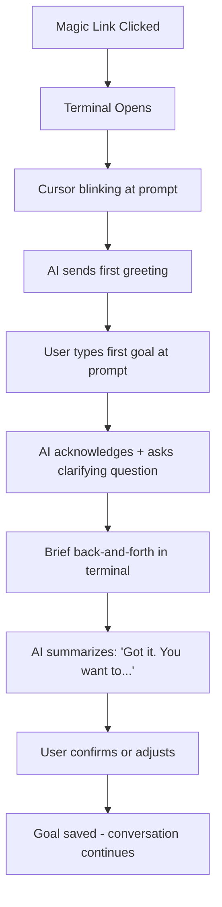
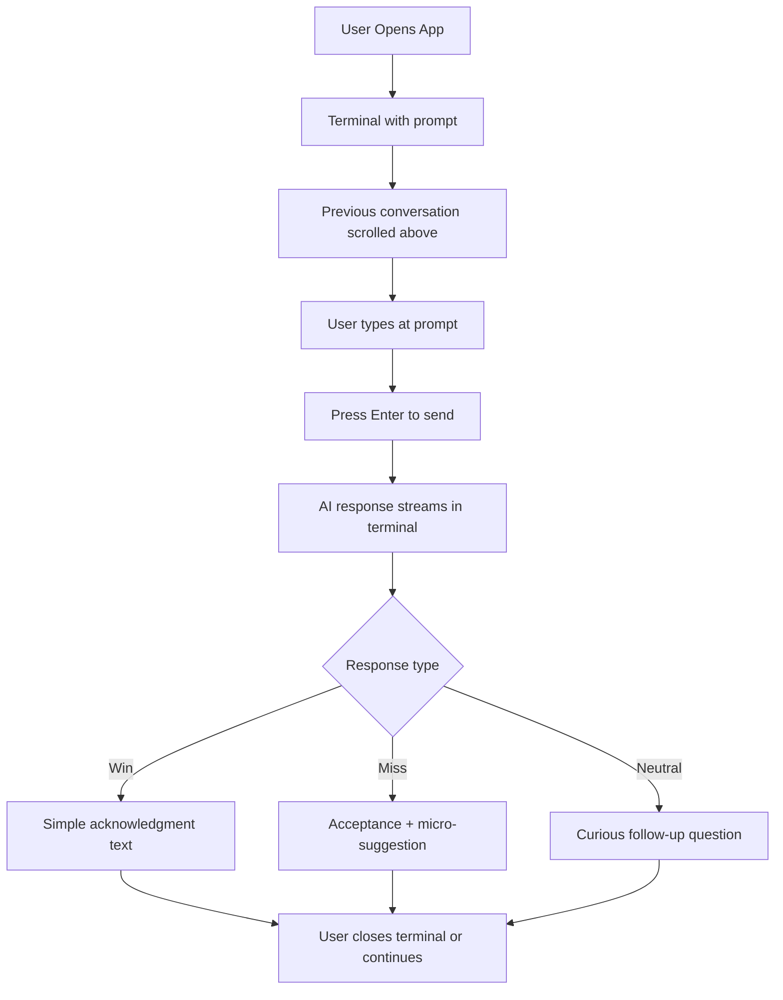
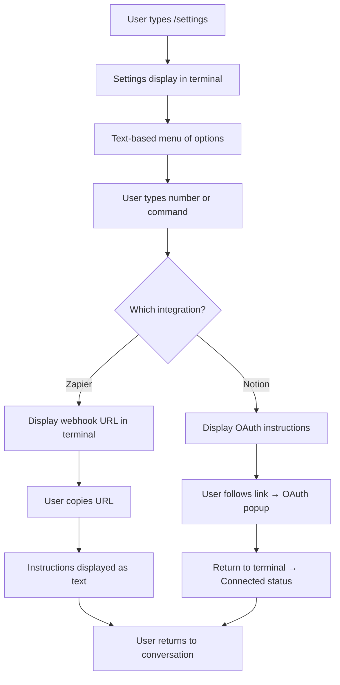
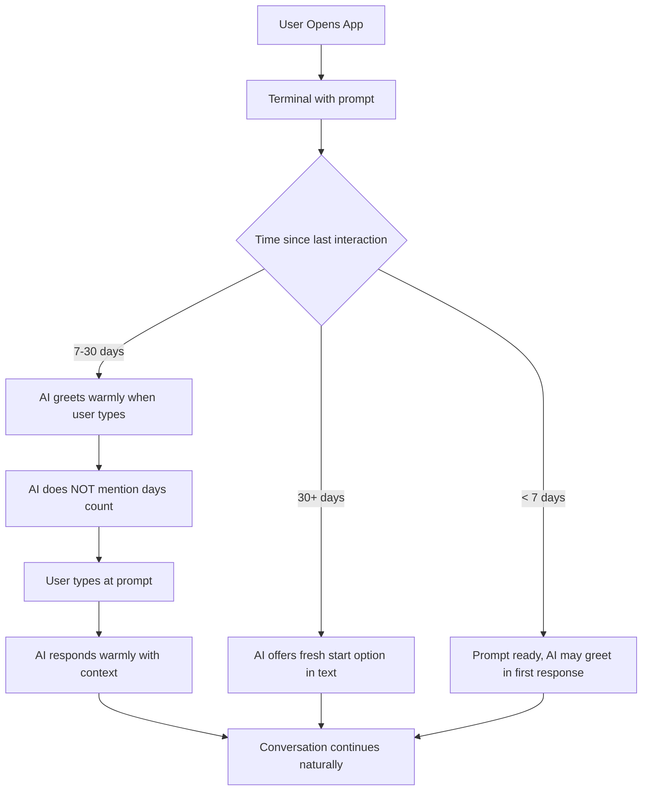

# UX Design Specification: Resolution Tracker

**Author:** Justin
**Date:** 2026-01-16
**Revision:** 2.0 - Retro Terminal Aesthetic

---

## Executive Summary

### Project Vision

Resolution Tracker is a conversational AI coach that helps users stick with their yearly goals by maintaining context, memory, and a warm relationship — solving the "February problem" where motivation fades and traditional apps fail.

The core UX philosophy: **the terminal is the interface**. Unlike bloated productivity apps with endless chrome and distractions, Resolution Tracker embraces the retro terminal aesthetic — amber phosphor text on dark screens, ASCII art, monospace typography, and the honest simplicity of a command line. This isn't nostalgia for its own sake; it's a deliberate rejection of manipulative UI patterns. The terminal aesthetic signals: *no tricks, no dark patterns, just you and a supportive AI having a conversation.*

The warmth comes from the words, not the pixels. The AI coach speaks with care while the interface stays out of the way — like a wise mentor who happens to communicate through a vintage terminal.

### Target Users

**Primary: The Busy Builder (Alex)**
- Knowledge workers (developers, designers, makers) with demanding jobs
- 2-4 personal goals that matter deeply but slip through the cracks
- Mentally exhausted by end of day — needs low-friction, not more work
- Seeks accountability that feels supportive, not surveillance
- Tech-savvy and appreciates the terminal aesthetic as authentic, not gimmicky

**Usage Context:**
- Responsive web (works identically on mobile and desktop)
- Quick check-ins throughout the day or evening wind-down
- Conversational interactions under 60 seconds
- Terminal aesthetic works naturally across all screen sizes

### Key Design Challenges

| Challenge | Implication |
|-----------|-------------|
| **Conversation as Interface** | Chat must feel like typing commands to a trusted system. The terminal aesthetic reinforces focus — no distractions, just dialogue. |
| **Progress Without Guilt** | No streaks, percentages, or color-coded shame. The terminal doesn't judge — it just responds. |
| **The Warm Return** | When users come back after days/weeks away, the terminal greets them simply. No guilt-inducing splash screens or "you've been gone X days" messages. |
| **Terminal Readability** | Amber-on-dark must be comfortable for extended reading. Proper contrast, generous line-height, appropriate font sizing. |

### Design Opportunities

| Opportunity | Approach |
|-------------|----------|
| **Terminal-First Architecture** | The command prompt is home. Everything flows through text. Goals, settings, and history are accessible but secondary. |
| **Retro Aesthetic, Modern Soul** | Amber phosphor visuals with cutting-edge AI underneath. The contrast is intentional — vintage interface, bleeding-edge intelligence. |
| **"Better Than Nothing" Philosophy** | The AI suggests micro-actions in plain text. No animated celebrations — just honest acknowledgment. |
| **Anti-Gamification Stance** | The terminal has no room for badges or streaks. Progress is tracked through conversation history, not metrics dashboards. |

## Core User Experience

### Defining Experience

The core experience is a **terminal session**:

1. User opens app → lands at the command prompt (no intermediary screens)
2. User types a message at the `>` prompt ("gym today" / "skipped, work chaos")
3. AI responds with streaming text — contextual, warm, remembers history
4. Conversation continues or user closes the terminal

This is a **terminal emulator**, not a messaging app. The mental model is a command line interface — direct, honest, no-nonsense. Users should feel like they're interacting with a wise system that speaks plainly and remembers everything.

**The Core Action:** Typing a check-in at the prompt and receiving a contextual response.

**Time to Value:** Under 10 seconds from app open to message sent.

### Platform Strategy

| Aspect | Decision |
|--------|----------|
| **Primary Platform** | Responsive web (terminal works everywhere) |
| **Secondary Platform** | N/A — same experience on all devices |
| **Native Apps** | Out of scope for MVP |
| **Interaction Model** | Keyboard-first, touch-compatible |
| **Offline Support** | Not required for MVP (always-connected assumed) |

**Terminal-First Implications:**
- Fixed-width container that looks intentional on any screen size
- Input always visible at bottom of terminal window
- Monospace font ensures consistent character alignment
- No complex responsive breakpoints needed — terminal is terminal
- Fast initial load (<2s on 3G)

### Effortless Interactions

| Interaction | Terminal Design |
|-------------|-----------------|
| **Opening the app** | Direct to terminal prompt. Cursor blinking, ready for input. |
| **Sending a check-in** | Type at `>` prompt, press Enter. No buttons required (though tap-to-send available). |
| **Reading AI response** | `COACH:` prefix, streaming text character-by-character. Authentic terminal feel. |
| **Returning after absence** | Terminal simply shows the prompt. AI greets naturally in first response. No splash screens. |
| **Viewing goals** | Type `/goals` command or access via simple menu. Text-based list, no cards. |

### Critical Success Moments

| Moment | Why It Matters |
|--------|----------------|
| **First AI response with context** | "Wait, it remembers I mentioned Tuesdays are hard?" — This is the aha moment. |
| **The warm return** | After 17 silent days, the AI says "Good to see you" — not "You've been gone 17 days." |
| **The micro-suggestion** | "Couldn't make the gym? How about 20 pushups?" — Turns failure into action. |
| **The quick check-in** | User types, gets response, closes terminal in under 30 seconds. Felt supported, not burdened. |

### Experience Principles

1. **The terminal is the product.** Everything flows through text. The prompt is home.

2. **Honest interface.** The terminal aesthetic signals authenticity — no tricks, no manipulative UI patterns, just conversation.

3. **Instant and streaming.** Responses appear immediately, character by character. Like watching output scroll in a real terminal.

4. **Memory without surveillance.** The AI remembers everything but never weaponizes it. Context creates connection, not guilt.

5. **Small is celebrated.** 20 pushups is a win. One Spanish flashcard is progress. The terminal acknowledges honestly, without fanfare.

## Desired Emotional Response

### Primary Emotional Goals

**Core Feeling: "A system I can trust."**

Resolution Tracker should feel like a wise terminal that:
- Remembers your story without judging it
- Acknowledges small wins without performative celebration
- Welcomes you back without mentioning how long you've been gone
- Speaks plainly and honestly, always on your side

The terminal aesthetic reinforces trust. There's nowhere for manipulation to hide in a command line. What you type is what you send. What you read is what the AI thinks. No dark patterns, no guilt mechanics — just honest text on a screen.

### Emotional Journey Map

| Stage | User State | Desired Emotion | Terminal Expression |
|-------|------------|-----------------|---------------------|
| **First open** | Curious, maybe skeptical | Ease, intrigue | Blinking cursor, ready. No onboarding walls. |
| **Typing check-in** | Tired, maybe rushed | Lightness, low effort | Simple `>` prompt. Type and press Enter. |
| **Reading AI response** | Waiting, hopeful | Surprise, warmth | `COACH:` streaming text, contextual memory |
| **After a win** | Accomplished | Quiet pride | Plain text acknowledgment. "Nice work." |
| **After a miss** | Guilty, deflated | Acceptance, redirect | "That's okay. What's one small thing you could do?" |
| **Returning after absence** | Shame, hesitation | Relief, welcome | Just the prompt. AI greets warmly in text. |
| **Completing a goal** | Proud, reflective | Quiet celebration | "You did it. Proud of you." — plain text, genuine. |

### Micro-Emotions

**Emotions to cultivate:**

| Emotion | Why It Matters |
|---------|----------------|
| **Trust** | The terminal aesthetic signals honesty — no tricks, no manipulation |
| **Confidence** | Clear prompt, clear responses. User always knows what to do. |
| **Accomplishment** | Small actions acknowledged plainly. No "gamification theater." |
| **Belonging** | The AI speaks like a trusted ally. You're not alone. |
| **Safety** | Can be honest about failures. The terminal doesn't judge. |

**Emotions to prevent:**

| Emotion | How We Prevent It |
|---------|-------------------|
| **Guilt** | No streaks, no counters, no passive-aggressive copy |
| **Anxiety** | No color-coded alerts, no urgency signals, no push notifications |
| **Overwhelm** | One prompt, one response. Terminal simplicity. |
| **Surveillance creep** | Memory feels supportive ("You mentioned...") not creepy ("On January 3rd you said...") |

### Emotional Design Principles

1. **Warmth through words.** The terminal is cold; the AI is warm. Contrast is intentional.

2. **Acknowledgment over celebration.** A goal completed gets "You did it. Proud of you." — plain text, not ASCII fireworks.

3. **Acceptance over accountability.** When users fail, meet them where they are. The terminal doesn't lecture.

4. **Presence over persuasion.** The prompt is always there, never pushy. No notifications begging for attention.

5. **Memory as connection.** Remembering details creates intimacy ("You mentioned Tuesdays are hard") — never weaponize it ("You've missed 3 Tuesdays").

## UX Pattern Analysis & Inspiration

### Inspiring Products Analysis

| Product | What They Nail | What We Take |
|---------|----------------|--------------|
| **Cool Retro Term** | Authentic CRT terminal emulation. Amber/green phosphor options, scanlines, subtle flicker. Nostalgia that's actually usable. | The visual foundation: amber phosphor, CRT glow effects, authentic terminal feel. |
| **Linear** | Rebuilt their theme system using LCH color space. Just 3 variables define entire themes. Dark mode that's comfortable for hours. | The technical approach: systematic color generation, perceptually uniform contrast. |
| **Raycast** | Bold accent colors against dark backgrounds. Clean monospace elements. Feels like a power tool, not a toy. | The confidence: dark interfaces that feel professional and cutting-edge. |

### Design Synthesis: "Warm Terminal"

The visual direction combines:
- **Authenticity from Cool Retro Term** — Amber phosphor, CRT effects, monospace typography
- **System from Linear** — Computed colors from minimal variables, consistent contrast
- **Confidence from Raycast** — Dark background, bold accents, power-user aesthetic

**The result:** A vintage terminal running a cutting-edge AI. The interface says "built by someone who knows what they're doing." The AI says "I'm here to help." Contrast creates character.

### Transferable UX Patterns

**Navigation Patterns:**
| Pattern | Source | Application |
|---------|--------|-------------|
| Prompt as home | Unix terminals | User lands at `>` prompt, cursor blinking |
| Command-based navigation | CLI conventions | `/goals`, `/settings`, `/help` commands available |
| Minimal chrome | Terminal emulators | Window frame optional, content is everything |

**Interaction Patterns:**
| Pattern | Source | Application |
|---------|--------|-------------|
| Streaming text | Terminal output | AI response streams character-by-character |
| Enter to submit | CLI conventions | Type and press Enter, no button needed |
| Command history | Shell conventions | Up arrow recalls previous messages |

**Visual Patterns:**
| Pattern | Source | Application |
|---------|--------|-------------|
| Monospace typography | All terminals | Consistent character width, authentic feel |
| Phosphor glow | CRT monitors | Text-shadow creates warm glow effect |
| Scanlines (subtle) | Vintage CRTs | Optional effect for extra authenticity |
| Box-drawing characters | ASCII art | `╔═══╗` borders for structure |

### Anti-Patterns to Avoid

| Anti-Pattern | Why It Fails | Our Alternative |
|--------------|--------------|-----------------|
| **Streak counters** | Creates guilt, triggers shame spirals | No visible counters or "days since" |
| **Color-coded status** | Judgmental, anxiety-inducing | Amber only, no red/green |
| **Onboarding wizards** | Delays value, breaks terminal metaphor | Straight to prompt, learn by typing |
| **Notification badges** | Nagging, creates obligation | No badges, no guilt mechanics |
| **Complex dashboards** | Overwhelming, breaks terminal simplicity | Everything through text commands |
| **Gamification elements** | Manipulative, antithetical to terminal honesty | Intrinsic motivation through conversation |

### Design Inspiration Strategy

**Adopt directly:**
- Terminal-first architecture (command prompt is home)
- Monospace typography throughout
- Streaming text output (character-by-character)
- Amber phosphor color palette
- Dark background with light text

**Adapt for our context:**
- CRT scanlines → very subtle, optional (don't sacrifice readability)
- Box-drawing characters → use for structure, not decoration
- Command syntax → simplified (plain text works, commands optional)
- Flicker effects → skip entirely (accessibility concern)

**Explicitly avoid:**
- Any gamification (streaks, badges, leaderboards)
- Multiple colors for status indication
- Heavy visual effects that harm readability
- Complex multi-screen flows
- Overly literal "hacker movie" aesthetics (no Matrix rain)

## Design System Foundation

### Design System Choice

**Primary:** Tailwind CSS + Custom Terminal Components

For the retro terminal aesthetic, we'll use Tailwind CSS for utility classes but build custom terminal-specific components rather than relying heavily on shadcn/ui. The terminal look requires specific styling that's better achieved through purpose-built components.

### Rationale for Selection

| Factor | Decision Driver |
|--------|-----------------|
| **Stack alignment** | Tailwind works perfectly with Next.js — zero friction |
| **Terminal specificity** | Custom components ensure authentic terminal feel |
| **Accessibility** | Custom focus states, keyboard navigation, screen reader support |
| **Simplicity** | Terminal UI is inherently simple — fewer components needed |
| **Developer experience** | Monospace + dark theme = consistent, predictable styling |
| **Performance** | Minimal CSS, no heavy component libraries |

### Implementation Approach

**Phase 1: Foundation Setup**
- Configure Tailwind with amber phosphor color palette
- Set up CSS custom properties for terminal theming
- Add CRT effect utilities (glow, scanlines as optional)

**Phase 2: Terminal Components**
- Build TerminalWindow container with optional frame
- Create TerminalInput with blinking cursor
- Build TerminalOutput for streaming text display
- Add ASCII box-drawing utilities

**Phase 3: Effects Layer**
- Implement text-shadow glow effect
- Add optional scanline overlay
- Create cursor blink animation

### Customization Strategy

**Color Palette — "Amber Phosphor"**

| Token | Value | Usage |
|-------|-------|-------|
| `--terminal-bg` | `#0a0a0a` | Terminal background (near-black) |
| `--terminal-bg-secondary` | `#141414` | Elevated surfaces, input areas |
| `--terminal-amber` | `#ffb000` | Primary text (P3 amber phosphor) |
| `--terminal-amber-dim` | `#b37a00` | Secondary text, timestamps |
| `--terminal-amber-glow` | `rgba(255, 176, 0, 0.4)` | Text-shadow glow effect |
| `--terminal-border` | `#2a2a2a` | Subtle borders, dividers |

**Border Radius — Sharp Corners**

| Element | Radius |
|---------|--------|
| Terminal window | `rounded-none` or `rounded-sm` (2px) |
| Input fields | `rounded-none` |
| Buttons | `rounded-none` |
| Everything | Sharp corners reinforce terminal aesthetic |

**Shadows — Glow, Not Drop**
- No traditional drop shadows
- Use `text-shadow` for phosphor glow effect
- Optional `box-shadow` glow on focused elements
- Example: `text-shadow: 0 0 8px var(--terminal-amber-glow)`

**Typography**

| Role | Spec |
|------|------|
| Font family | `'IBM Plex Mono', 'Fira Code', 'Courier New', monospace` |
| Body size | 16px base (readable on all devices) |
| Line height | 1.6 (generous for readability) |
| Font weight | 400 regular, 500 for emphasis |

### Component Inventory (MVP)

| Component | Base | Notes |
|-----------|------|-------|
| **TerminalWindow** | Custom | Main container, optional ASCII frame |
| **TerminalInput** | Custom | `>` prompt, blinking cursor, Enter to submit |
| **TerminalOutput** | Custom | Streaming text with `COACH:` prefix |
| **TerminalLine** | Custom | Single line of output (user or AI) |
| **ASCIIBox** | Custom | Box-drawing character containers |
| **CommandHelp** | Custom | `/help` output formatting |
| **GoalList** | Custom | Text-based goal listing |

## Defining Experience

### The One-Line Pitch

> "Type what happened. Get understood."

The magic isn't the terminal — that's just the vehicle. The magic is the *response*. The moment the AI says something that proves it knows you. That's the aha moment that creates loyalty. The terminal aesthetic just gets out of the way.

### User Mental Model

**What users bring to this experience:**

| Expectation | Source | Implication |
|-------------|--------|-------------|
| "I type and press Enter" | Every terminal ever | Zero learning curve for tech-savvy users |
| "It should remember what I told it" | Human conversation | Context must persist across sessions |
| "It won't judge me" | The terminal's neutrality | Tone must be warm, interface stays neutral |
| "Quick interactions, not journaling" | CLI efficiency | Optimize for 1-2 sentences, not paragraphs |

**What users are escaping:**

| Current Solution | Why It Fails | Our Advantage |
|------------------|--------------|---------------|
| Habit tracker apps | Checkbox fatigue, guilt mechanics | Conversational, no pass/fail |
| Note-taking apps | No feedback, feels like shouting into void | AI responds with understanding |
| Accountability buddies | Requires coordination, social pressure | Always available, no judgment |
| Bloated productivity apps | Too many features, too much UI | Terminal simplicity, just text |

### Success Criteria

**The interaction succeeds when:**

| Criteria | Measurement |
|----------|-------------|
| **Speed** | Message sent within 10 seconds of opening |
| **Naturalness** | User types in plain language at the prompt |
| **Recognition** | AI response references something specific from user's history |
| **Emotional landing** | User closes terminal feeling lighter, not burdened |
| **Return intent** | User wants to come back tomorrow |

**The "tell a friend" moment:**

> *"It's like a terminal that talks back. I typed 'skipped gym again' and it said 'Tuesdays have been hard lately — what's going on at work?' It actually remembered."*

This story — AI demonstrating genuine memory in a no-nonsense interface — is what users will share.

### Pattern Analysis

| Aspect | Classification | Notes |
|--------|---------------|-------|
| **Terminal interface** | Retro-novel | Familiar to developers, distinctive to others |
| **Streaming responses** | Established | ChatGPT normalized this; feels like terminal output |
| **Emotional AI memory** | Novel | Most AI is stateless; persistent emotional context is rare |
| **No-guilt design** | Novel | Anti-pattern to industry norms; terminal reinforces this |

**Our innovation lives in the AI's emotional intelligence, not the interface.**

The terminal aesthetic supports this by being radically simple. No UI to compete with the conversation.

### Experience Mechanics

**1. Initiation**

| Element | Design |
|---------|--------|
| Trigger | Open app |
| Landing | Terminal with blinking cursor at `>` prompt |
| Invitation | Cursor blinks, ready for input. Optional: AI sends first greeting. |
| Friction | Zero — no splash, no dashboard, no choices |

**2. Interaction**

| Element | Design |
|---------|--------|
| Input method | Text input after `>` prompt |
| Send action | Press Enter (tap-to-send button available for mobile) |
| Message length | Optimized for 1-2 sentences (but accepts more) |
| Typing feel | Monospace font, cursor visible, immediate response |

**3. Feedback**

| Element | Design |
|---------|--------|
| Response timing | Immediate streaming (no "thinking" delay) |
| Visual treatment | `COACH:` prefix, same amber text, streaming output |
| Content quality | References context, acknowledges emotion, offers micro-action if appropriate |
| Length | Concise — matches user's energy (short input → short response) |

**4. Completion**

| Element | Design |
|---------|--------|
| Done signal | Natural conversation pause — user simply stops |
| Exit action | Close browser/app (no "save" needed) |
| Emotional state | Lighter, supported, not burdened with tasks |
| Next session | AI remembers everything; continuity is automatic |

## Visual Design Foundation

### Color System

**Core Palette — "Amber Phosphor"**

| Token | Hex | RGB | Usage |
|-------|-----|-----|-------|
| `--terminal-bg` | #0a0a0a | 10, 10, 10 | Terminal background (near-black) |
| `--terminal-bg-light` | #141414 | 20, 20, 20 | Input area, elevated surfaces |
| `--terminal-amber` | #ffb000 | 255, 176, 0 | Primary text (P3 amber phosphor) |
| `--terminal-amber-bright` | #ffc940 | 255, 201, 64 | Emphasized text, headings |
| `--terminal-amber-dim` | #b37a00 | 179, 122, 0 | Secondary text, timestamps, dimmed |
| `--terminal-border` | #2a2a2a | 42, 42, 42 | Subtle borders, ASCII frames |
| `--terminal-glow` | rgba(255, 176, 0, 0.4) | — | Text-shadow glow effect |

**Semantic Colors — Terminal Simplicity**

The terminal aesthetic uses ONE color (amber) with variations in brightness. No red/green indicators.

| Purpose | Approach | Implementation |
|---------|----------|----------------|
| **Normal text** | Standard amber | `--terminal-amber` |
| **Emphasis** | Brighter amber | `--terminal-amber-bright` |
| **Secondary/Dim** | Darker amber | `--terminal-amber-dim` |
| **System error** | Same amber, prefixed | `ERROR:` prefix, same color |
| **User input** | Preceded by prompt | `> ` prefix identifies user text |
| **AI response** | Preceded by label | `COACH:` prefix identifies AI text |

*Note: No color-coding for status. The terminal treats all text equally. Meaning comes from words, not colors.*

**CRT Effects (Optional)**

| Effect | CSS Implementation | Usage |
|--------|-------------------|-------|
| **Phosphor glow** | `text-shadow: 0 0 8px var(--terminal-glow)` | Applied to all text |
| **Scanlines** | `background: repeating-linear-gradient(...)` | Subtle overlay, 50% opacity max |
| **Screen curve** | `border-radius` on container edges | Optional, very subtle |
| **Vignette** | `radial-gradient` darkening edges | Optional ambient effect |

### Typography System

**Font Stack**

| Priority | Font | Notes |
|----------|------|-------|
| 1st | IBM Plex Mono | Clean, highly readable monospace |
| 2nd | Fira Code | Popular with developers, ligature support |
| 3rd | JetBrains Mono | Modern monospace alternative |
| Fallback | 'Courier New', monospace | Universal fallback |

**Recommended:** IBM Plex Mono — it has the best balance of authenticity and readability.

**Type Scale (Terminal-Appropriate)**

| Token | Size | Weight | Line Height | Usage |
|-------|------|--------|-------------|-------|
| `--text-xs` | 12px | 400 | 1.4 | Timestamps, system messages |
| `--text-sm` | 14px | 400 | 1.5 | Secondary text, help text |
| `--text-base` | 16px | 400 | 1.6 | Primary text, conversation |
| `--text-lg` | 18px | 500 | 1.5 | ASCII art headers, emphasis |
| `--text-xl` | 20px | 400 | 1.4 | Terminal title (if shown) |

**Typography Principles**

1. **Monospace only** — No mixing fonts. Everything in the same monospace family.
2. **Generous line height** — 1.6 for body text; essential for readability on dark backgrounds
3. **No bold abuse** — Use brightness variation (`--terminal-amber-bright`) instead of heavy weights
4. **Character alignment** — Monospace ensures ASCII art and box-drawing characters align perfectly

### Spacing & Layout Foundation

**Base Unit: Character Width**

In a terminal, spacing often relates to character width. For a 16px monospace font, one character ≈ 9.6px wide.

| Token | Value | Usage |
|-------|-------|-------|
| `--space-1` | 4px | Minimal gaps |
| `--space-2` | 8px | ~1 character width |
| `--space-3` | 16px | ~2 characters, standard padding |
| `--space-4` | 24px | Between conversation turns |
| `--space-6` | 32px | Section breaks |
| `--space-8` | 48px | Major divisions |

**Layout Principles**

| Principle | Implementation |
|-----------|----------------|
| **Fixed-width terminal** | Max-width 800px, centered on large screens |
| **Full-width on mobile** | Terminal fills viewport on small screens |
| **Consistent padding** | 16px horizontal padding at all sizes |
| **Line-based spacing** | Vertical rhythm based on line-height |

**Terminal Layout Specifics**

| Element | Specification |
|---------|---------------|
| Terminal max-width | 800px (approximately 80 characters) |
| Terminal min-height | 100vh (fills viewport) |
| Input area height | Auto, min 48px |
| Line spacing | 1.6 line-height, 8px between conversation turns |
| Prompt character | `> ` (greater-than + space) |

### Accessibility Considerations

**Contrast Ratios (WCAG AA)**

| Combination | Ratio | Status |
|-------------|-------|--------|
| Amber (#ffb000) on Black (#0a0a0a) | ~12:1 | Exceeds AA |
| Dim amber (#b37a00) on Black | ~6.5:1 | Passes AA |
| Bright amber (#ffc940) on Black | ~14:1 | Exceeds AA |

*Amber on dark is excellent for accessibility — better than green phosphor.*

**Touch & Interaction**

| Requirement | Implementation |
|-------------|----------------|
| Minimum touch target | 44x44px for send button, input area fills width |
| Focus indicators | Amber glow ring (box-shadow with --terminal-glow) |
| Tap feedback | Brief brightness increase on interactive elements |
| Keyboard navigation | Tab moves between input and any controls |

**Motion & Animation**

| Type | Approach |
|------|----------|
| Cursor blink | `animation: blink 1s step-end infinite` |
| Text streaming | Character-by-character append, no animation |
| Transitions | Minimal, 100-150ms for state changes |
| Reduced motion | Respect `prefers-reduced-motion` — disable cursor blink, scanlines |

**Readability Safeguards**

| Concern | Mitigation |
|---------|------------|
| Eye strain on dark | Generous line-height, not-quite-black background |
| Scanline interference | Maximum 30% opacity, disable option available |
| Glow causing blur | Subtle glow only, high-contrast text always readable |
| Small text | Minimum 14px, prefer 16px for conversation |

## Design Direction

### Chosen Direction: "Warm Terminal"

A single cohesive visual direction synthesizing all decisions made throughout this process:
- **Aesthetic:** Retro CRT terminal with amber phosphor display
- **Warmth:** Comes from the AI's words, not the pixels — contrast is intentional
- **Interaction:** Terminal-first, prompt-based input, streaming text output

### Visual Identity Summary

| Element | Decision |
|---------|----------|
| Primary color | Amber phosphor (#ffb000) |
| Background | Near-black (#0a0a0a) |
| Typography | IBM Plex Mono, consistent weight |
| Border radius | None or minimal (2px max) |
| AI representation | `COACH:` text prefix (no icons) |
| Message display | Scrolling terminal output, no bubbles |

### Screen Hierarchy

| Screen | Role | Access |
|--------|------|--------|
| **Terminal** | Primary — user lands at prompt | Default home |
| **Goals** | Secondary — text list via `/goals` | Command or menu |
| **Settings** | Tertiary — via `/settings` | Command or menu |
| **Help** | Reference — via `/help` | Command |

### Terminal Mockup

```
╔══════════════════════════════════════════════════════════════════════════════╗
║  RESOLUTION TRACKER v1.0                                           [—][□][×] ║
╠══════════════════════════════════════════════════════════════════════════════╣
║                                                                              ║
║  COACH: Good to see you. How's it going today?                               ║
║                                                                              ║
║  > skipped the gym again, work was insane                                    ║
║                                                                              ║
║  COACH: Tuesdays have been rough lately. Work still chaotic? Remember —      ║
║  even 10 minutes counts. What's one small thing you could do tonight?        ║
║                                                                              ║
║  > maybe just some stretching before bed                                     ║
║                                                                              ║
║  COACH: That's the move. Stretching is underrated. Let me know how it        ║
║  goes tomorrow.                                                              ║
║                                                                              ║
║  > ▌                                                                         ║
║                                                                              ║
╚══════════════════════════════════════════════════════════════════════════════╝
```

*Note: ASCII frame is optional — can use minimal chrome or full retro frame based on preference.*

## User Journey Flows

### Journey 1: Fresh Start (Onboarding)

**Goal:** New user goes from signup to first meaningful conversation in under 2 minutes.

**Entry point:** Magic link email → Terminal opens



**Key UX decisions:**
- No onboarding screens — straight to terminal prompt
- AI initiates with a simple greeting, then asks about goals
- Everything happens in the terminal — no forms, no wizards
- Goal setup feels like a conversation, not configuration

**Success moment:** AI's first contextual response ("So you want to hit the gym but mornings are tough?")

---

### Journey 2: The Mixed Day (Core Check-in Loop)

**Goal:** User logs a check-in and feels supported in under 30 seconds.

**Entry point:** User opens app (returning user)



**Key UX decisions:**
- Conversation history visible in scroll-back (like a real terminal)
- No timestamps highlighted, no "last seen" indicators
- AI matches user's energy (short input → concise response)
- Enter to send — no button required (but available for mobile)

**Success moment:** AI references past context ("Tuesdays have been rough lately...")

---

### Journey 3: Sunday Tinkering (Integrations Setup)

**Goal:** User connects Notion and/or Zapier to sync their data.

**Entry point:** User types `/settings` or accesses menu



**Key UX decisions:**
- Settings accessed via command (`/settings`) or minimal menu
- All instructions displayed as terminal text
- OAuth opens in new window, returns to terminal
- Clear text confirmation when connection succeeds

**Success moment:** `SYSTEM: Notion connected successfully.`

---

### Journey 4: The Quiet Return (Re-engagement)

**Goal:** User returns after absence and feels welcomed, not judged.

**Entry point:** User opens app after 17+ days away



**Key UX decisions:**
- NO guilt messaging (no "You've been gone for 17 days!")
- Terminal simply shows the prompt — neutral, ready
- AI warmth comes through in the response text
- Fresh start option offered conversationally, not as a popup

**Success moment:** `COACH: Good to see you. How are things?` — no mention of the gap.

---

### Journey Patterns

**Common patterns across all journeys:**

| Pattern | Implementation |
|---------|----------------|
| **Terminal as home** | Every journey starts or returns to the prompt |
| **Text-first** | No forms, no wizards — everything through typing |
| **No guilt mechanics** | Time gaps never mentioned, no counters |
| **Streaming output** | All AI responses stream character-by-character |
| **Command-based navigation** | `/help`, `/goals`, `/settings` for secondary screens |

---

### Flow Optimization Principles

1. **Time to value < 30 seconds** — User should feel supported within half a minute of any action
2. **One question at a time** — Never overwhelm with multiple asks
3. **Context over configuration** — AI infers preferences from conversation, doesn't ask for settings
4. **Graceful degradation** — If something fails, display `ERROR:` message with retry instruction
5. **Always recoverable** — No destructive actions without clear confirmation prompt

## Component Strategy

### Terminal Component Architecture

The terminal aesthetic requires purpose-built components. We're not using shadcn/ui card/button patterns — everything is text-based.

**Component Philosophy:**
- Everything renders as text in a monospace font
- No rounded corners, no shadows, no gradients
- Interactivity through keyboard (Enter, arrows) with touch fallbacks
- ASCII characters for structure where needed

### Core Components

#### TerminalWindow

**Purpose:** Main container that holds the entire terminal interface.

| Property | Details |
|----------|---------|
| **Layout** | Full viewport height, max-width 800px, centered |
| **Content** | TerminalOutput (scrollable) + TerminalInput (fixed bottom) |
| **Optional** | ASCII frame border, title bar with fake buttons |

**Specifications:**
```
- Background: var(--terminal-bg) #0a0a0a
- Font: IBM Plex Mono, 16px, line-height 1.6
- Padding: 16px
- Max-width: 800px (centered on desktop)
- Min-height: 100vh or 100dvh
- Optional frame: ASCII box-drawing characters
- Optional glow: subtle radial gradient overlay
```

**ASCII Frame Option:**
```
╔══════════════════════════════════════════════════╗
║  RESOLUTION TRACKER                    [—][□][×] ║
╠══════════════════════════════════════════════════╣
║                                                  ║
║  (content here)                                  ║
║                                                  ║
╚══════════════════════════════════════════════════╝
```

---

#### TerminalOutput

**Purpose:** Scrollable area displaying conversation history.

| Property | Details |
|----------|---------|
| **Content** | Array of TerminalLine components |
| **Scroll** | Auto-scroll to bottom on new content |
| **History** | Preserves scroll position when user scrolls up |

**Specifications:**
```
- Flex: 1 (fills available space)
- Overflow-y: auto
- Scroll behavior: smooth
- Auto-scroll: on new message (unless user has scrolled up)
- Padding-bottom: space for input area
```

---

#### TerminalLine

**Purpose:** Single line of conversation (user input or AI response).

| Property | Details |
|----------|---------|
| **Variants** | `user` (prefixed with `> `), `ai` (prefixed with `COACH: `), `system` (prefixed with `SYSTEM: `) |
| **Content** | Plain text, may wrap across multiple lines |
| **States** | Static, Streaming (for AI responses) |

**Specifications:**
```
- User line: "> " prefix in dim amber, message in standard amber
- AI line: "COACH: " prefix in bright amber, message in standard amber
- System line: "SYSTEM: " prefix in dim amber, message in dim amber
- Line spacing: margin-bottom 8px between conversation turns
- Word wrap: break-word (long text wraps naturally)
- Streaming: cursor character (▌) blinks at end during streaming
```

**Example Output:**
```
> skipped the gym again

COACH: Tuesdays have been rough lately. Work still chaotic?
What's one small thing you could do tonight?

> maybe just stretching

COACH: That's the move. Let me know how it goes.
```

**Accessibility:**
- Use `role="log"` on container with `aria-live="polite"`
- Screen reader announces new messages
- Prefixes ("You said:", "Coach said:") for screen readers via `aria-label`

---

#### TerminalInput

**Purpose:** Text input area for user messages.

| Property | Details |
|----------|---------|
| **Elements** | Prompt character (`> `), text input, optional send button (mobile) |
| **States** | Ready, Typing, Sending, Disabled |
| **Behavior** | Enter to send, clear after send, focus on load |

**Specifications:**
```
- Position: sticky bottom or fixed bottom
- Background: var(--terminal-bg-light) #141414
- Padding: 16px
- Prompt: "> " in dim amber, inline before input
- Input: transparent background, amber text, no border
- Cursor: custom blinking block cursor (CSS)
- Send button (mobile): Optional, amber text "SEND" or arrow icon
- Min-height: 48px
```

**Cursor Animation:**
```css
@keyframes blink {
  0%, 50% { opacity: 1; }
  51%, 100% { opacity: 0; }
}
.cursor { animation: blink 1s step-end infinite; }
```

**Accessibility:**
- Input has `aria-label="Type your message"`
- Enter triggers send
- Focus visible with amber glow ring

---

#### CommandOutput

**Purpose:** Formatted output for commands like `/help`, `/goals`, `/settings`.

| Property | Details |
|----------|---------|
| **Content** | Structured text with headers, lists, tables |
| **Format** | Uses ASCII characters for structure |

**Example: /help Output:**
```
╭─────────────────────────────────────────────────╮
│  AVAILABLE COMMANDS                             │
├─────────────────────────────────────────────────┤
│  /goals     - View your current goals           │
│  /settings  - Manage integrations & preferences │
│  /help      - Show this help message            │
│  /clear     - Clear conversation history        │
╰─────────────────────────────────────────────────╯
```

**Example: /goals Output:**
```
YOUR GOALS
──────────
1. [active]  Hit the gym 3x per week
2. [active]  Learn Spanish (15 min daily)
3. [done]    Read 12 books this year ✓
```

---

#### SystemMessage

**Purpose:** Non-conversational system notifications.

| Property | Details |
|----------|---------|
| **Types** | Info, Error, Success |
| **Style** | Dim amber, prefixed with `SYSTEM:` |

**Examples:**
```
SYSTEM: Connected to Notion successfully.
SYSTEM: ERROR - Network unavailable. Retrying...
SYSTEM: Your message has been sent.
```

---

### Component Implementation Strategy

**Build Order:**

| Phase | Components | Unlocks |
|-------|------------|---------|
| **1. Terminal Shell** | TerminalWindow, TerminalOutput, TerminalInput | Basic conversation |
| **2. Conversation** | TerminalLine (all variants) | User/AI dialogue |
| **3. Commands** | CommandOutput, command parsing | /help, /goals, /settings |
| **4. System** | SystemMessage | Notifications, errors |
| **5. Effects** | Scanlines, glow (optional) | Visual polish |

**Implementation Guidelines:**

1. **CSS Variables First** — All colors from `--terminal-*` tokens
2. **Monospace Everything** — Single font family throughout
3. **Keyboard-First** — Enter to send, arrow keys for history
4. **Touch Fallbacks** — Send button visible on touch devices
5. **Progressive Enhancement** — Works without JS for basic display
6. **Test in Mono** — All ASCII art must align in monospace

## UX Consistency Patterns

### Feedback Patterns

**Message Sending:**
| State | Terminal Feedback |
|-------|-------------------|
| Composing | Text appears after `>` prompt, cursor blinks |
| Sending | Message appears in output immediately (optimistic) |
| Sent | No indicator needed — appears in conversation |
| Failed | `SYSTEM: ERROR - Message failed. Press Enter to retry.` |

**AI Responding:**
| State | Terminal Feedback |
|-------|-------------------|
| Processing | `COACH: ` appears with blinking cursor |
| Streaming | Text streams character-by-character after prefix |
| Complete | Cursor moves to new input line |
| Error | `SYSTEM: ERROR - Response failed. Type /retry or send again.` |

**System Feedback (Inline Text):**
| Type | Format | Example |
|------|--------|---------|
| Success | `SYSTEM: [message]` | `SYSTEM: Connected to Notion.` |
| Info | `SYSTEM: [message]` | `SYSTEM: Goals synced.` |
| Error | `SYSTEM: ERROR - [message]` | `SYSTEM: ERROR - Network unavailable.` |

*No toasts, no popups — everything appears inline in the terminal.*

**No Guilt Feedback Rule:**
- NEVER show: "You haven't checked in for X days"
- NEVER show: "Streak lost" or similar
- NEVER use color to indicate failure — same amber for everything

---

### Loading & Empty States

**Terminal Loading (Initial):**
```
SYSTEM: Connecting...
SYSTEM: Loading conversation history...
```
*Then conversation appears. No spinners, no skeletons — just text.*

**AI Thinking:**
```
COACH: ▌
```
*Blinking cursor after prefix indicates response incoming.*

**Empty Terminal (New User):**
```
RESOLUTION TRACKER v1.0
══════════════════════

COACH: Hey! I'm your resolution coach. What's one goal
you want to work on this year?

> ▌
```
*AI initiates the conversation — no empty state.*

**Empty Goals List:**
```
YOUR GOALS
──────────
No goals yet. Just chat with me to set your first one.

> ▌
```

**Offline State:**
```
SYSTEM: You're offline. Messages will send when reconnected.

> ▌
```
*Input remains available — messages queue locally.*

---

### Navigation Patterns

**Primary Navigation (Commands):**
| Command | Action |
|---------|--------|
| `/help` | Display available commands |
| `/goals` | Display goal list |
| `/settings` | Display settings menu |
| `/clear` | Clear conversation history |

**Menu Alternative (Touch):**
| Element | Behavior |
|---------|----------|
| Menu icon | Top-right corner, hamburger or `☰` character |
| Menu style | Displays as text list in terminal |
| Menu items | Goals, Settings, Help, Clear |

**Back Navigation:**
| Context | Behavior |
|---------|----------|
| After `/goals` | Type anything to return to conversation |
| After `/settings` | Type `done` or anything to return |
| Browser back | Returns to previous state |

**Deep Linking:**
| Link | Destination |
|------|-------------|
| `/` | Terminal (home) |
| `/auth` | Magic link callback → returns to terminal |

---

### Text Hierarchy (No Buttons)

**User Actions:**
```
- Type at prompt and press Enter
- Commands start with `/`
- Confirmations: type `yes` or `no`
```

**Emphasis in Text:**
```
- Standard: var(--terminal-amber)
- Emphasis: var(--terminal-amber-bright) or UPPERCASE
- Dim: var(--terminal-amber-dim)
```

**Destructive Confirmations:**
```
SYSTEM: Delete goal "Hit the gym 3x per week"?
Type YES to confirm, or anything else to cancel.

> ▌
```

---

### Error Handling Patterns

**Network Errors:**
| Scenario | Response |
|----------|----------|
| Message fails to send | `SYSTEM: ERROR - Send failed. Press Enter to retry.` |
| AI response fails | `SYSTEM: ERROR - Response failed. Type /retry.` |
| Page fails to load | Show minimal terminal with error message and retry prompt |
| Auth fails | `SYSTEM: ERROR - Authentication failed. Check your email for a new link.` |

**User Errors:**
| Scenario | Response |
|----------|----------|
| Empty message send | Nothing happens (Enter on empty does nothing) |
| Unknown command | `SYSTEM: Unknown command. Type /help for options.` |
| Goal limit reached | `SYSTEM: You have 5 goals. Complete or remove one first.` |

**Error Copy Guidelines:**
- Always prefix with `SYSTEM: ERROR -`
- Be specific about what failed
- Suggest the next action (retry, type command, etc.)
- Never blame the user

---

### Confirmation Patterns

**When to Confirm:**
- Deleting a goal
- Clearing conversation history
- Disconnecting an integration
- Signing out

**When NOT to Confirm:**
- Sending a message
- Adding a goal through conversation
- Minor edits

**Confirmation Style (Terminal):**
```
SYSTEM: Clear all conversation history?
This cannot be undone. Type YES to confirm.

> YES

SYSTEM: History cleared.
```

---

### Keyboard Patterns

**Desktop:**
| Key | Action |
|-----|--------|
| Enter | Send message |
| Up Arrow | Recall previous message (command history) |
| Down Arrow | Move forward in command history |
| Escape | Clear current input |
| Ctrl+L | Clear screen (like real terminal) |

**Mobile:**
| Interaction | Behavior |
|-------------|----------|
| Tap terminal | Focus input, keyboard appears |
| Tap Send button | Send message (for users who don't know Enter) |
| Swipe up | Scroll through history |
| Tap outside input | Keyboard dismisses |

**Input Behavior:**
- Focus on input automatically when terminal loads
- Keyboard stays open after sending (ready for next message)
- Single-line input by default (no Shift+Enter needed)

## Responsive Design & Accessibility

### Responsive Strategy

**Design Philosophy: Terminal-Native Responsiveness**

The terminal aesthetic solves the responsive problem elegantly. A terminal is a terminal — it fills its container and text wraps naturally. No complex multi-column layouts to manage.

| Device | Approach |
|--------|----------|
| **Mobile** | Terminal fills viewport, 16px padding |
| **Tablet** | Same as mobile, more breathing room |
| **Desktop** | Terminal max-width 800px, centered, optional frame |

**What Changes on Desktop:**
- Terminal container: max-width 800px (approximately 80 characters)
- Centered on screen with subtle background visible around edges
- Optional: ASCII frame border visible
- Keyboard shortcuts fully available (Enter, Up/Down arrows, Ctrl+L)

**What Stays the Same:**
- Same monospace font and sizing
- Same color scheme
- Same interaction patterns
- Same conversation display

**The Terminal Advantage:**
The terminal aesthetic means there's no "mobile version" vs "desktop version" — it's the same terminal on every screen. This eliminates the "centered mobile app" problem entirely.

---

### Breakpoint Strategy

**Minimal Breakpoints Needed:**

| Breakpoint | Width | Change |
|------------|-------|--------|
| `sm` | 640px | Minor padding adjustments |
| `lg` | 1024px | Apply max-width, center terminal |

**That's it.** The terminal doesn't need complex responsive logic.

**Layout Implementation:**

```css
/* Base: All screens */
.terminal {
  width: 100%;
  min-height: 100dvh;
  padding: 16px;
  font-family: 'IBM Plex Mono', monospace;
  font-size: 16px;
  line-height: 1.6;
  background: var(--terminal-bg);
  color: var(--terminal-amber);
}

/* Desktop: Centered with max-width */
@media (min-width: 1024px) {
  .terminal {
    max-width: 800px;
    margin: 0 auto;
    /* Optional: add subtle border or shadow */
  }
}
```

---

### Accessibility Strategy

**Target: WCAG 2.1 Level AA**

The terminal aesthetic is inherently accessible — high contrast, simple layout, keyboard-first design.

**Core Accessibility Requirements:**

| Category | Requirement | Terminal Implementation |
|----------|-------------|------------------------|
| **Color Contrast** | 4.5:1 minimum | Amber on black exceeds 12:1 |
| **Touch Targets** | 44x44px minimum | Input area fills width, send button 44px+ |
| **Keyboard Navigation** | Full support | Enter, arrows, Escape all functional |
| **Screen Readers** | Semantic HTML + ARIA | `role="log"`, proper announcements |
| **Focus Indicators** | Visible focus | Amber glow ring on focused elements |
| **Reduced Motion** | Respect preferences | Disable cursor blink, scanlines |

**Terminal-Specific Accessibility:**

| Element | Accessibility Approach |
|---------|------------------------|
| Conversation area | `role="log"` with `aria-live="polite"` |
| User messages | Screen reader: "You said: [message]" |
| AI messages | Screen reader: "Coach said: [message]" |
| Streaming text | Announced when complete, not character-by-character |
| Input | `aria-label="Type your message"` |
| Commands | Announced as "Command output: [content]" |

**High Contrast Advantage:**
Amber (#ffb000) on near-black (#0a0a0a) has a contrast ratio of approximately 12:1 — far exceeding WCAG AA requirements (4.5:1) and even AAA (7:1).

**Accessibility Do's and Don'ts:**

| Do | Don't |
|----|-------|
| Keep monospace font at 16px minimum | Use tiny fonts for "authenticity" |
| Announce streaming completion | Read every character as it streams |
| Provide keyboard shortcuts | Require mouse for any action |
| Test with screen readers | Assume text = accessible |
| Offer option to disable effects | Force scanlines/glow on everyone |

---

### Testing Strategy

**Responsive Testing:**

| Method | Tools | When |
|--------|-------|------|
| Browser DevTools | Chrome/Firefox responsive mode | Every PR |
| Real devices | iPhone SE, Pixel, iPad | Before release |
| Cross-browser | Chrome, Safari, Firefox | Before release |

**Priority Test Cases:**
1. iPhone SE (375px) — smallest common viewport
2. Desktop 1440px — verify max-width centering works
3. Tablet 768px — ensure padding looks right

**Accessibility Testing:**

| Method | Tools | When |
|--------|-------|------|
| Automated | axe DevTools, Lighthouse | Every PR |
| Keyboard | Manual Tab/Enter/Arrow testing | Every feature |
| Screen reader | VoiceOver, NVDA | Before release |
| Reduced motion | Test with preference enabled | Before release |

**Testing Checklist (Per Feature):**
- [ ] Works on iPhone SE (375px)
- [ ] Keyboard navigable (Tab, Enter, Escape, Arrows)
- [ ] Screen reader announces messages correctly
- [ ] Works with `prefers-reduced-motion`
- [ ] Contrast passes in all states
- [ ] Monospace alignment preserved

---

### Implementation Guidelines

**For Developers:**

**Terminal Responsive:**
```
- Use 100dvh for full viewport (handles mobile browser chrome)
- Max-width: 800px on desktop, centered with margin: 0 auto
- 16px padding on all screen sizes
- Let text wrap naturally — don't fight it
- Safe-area-inset-bottom for input on notched phones
```

**Terminal Accessibility:**
```
- role="log" on conversation container
- aria-live="polite" for new messages
- aria-label on input and any buttons
- Visible focus states with amber glow
- Don't disable text selection
- Support system font-size preferences where possible
```

**Performance:**
```
- Monospace fonts are small — load IBM Plex Mono subset
- No images to optimize (text-only UI)
- Lazy load conversation history beyond viewport
- Target < 1.5s First Contentful Paint (simple UI)
- Stream AI responses for perceived performance
```

**CRT Effects (Optional):**
```
- Disable all effects if prefers-reduced-motion
- Scanlines: max 30% opacity, toggleable
- Glow: subtle only, never blur text
- No flicker effects (accessibility concern)
```
